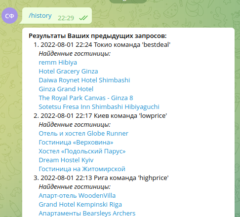

# Инструкция по работе с телеграм-ботом по поиску отелей

## I. Настройки бота.

Настройки бота, параметров поиска и др. можно найти в файле config.py
По-умолчанию, для запросов используется локаль _ru_RU_ (русский язык), валюта "_RUB_" (российский рубль)

## II. Зависимости.

Для запуска бота должны быть удовлетворены следующие зависимости:

python > 3.8

requirements.txt

## III. Запуск бота.

Запуск бота выполняется в терминале с помощью команды: 
**python main.py**

## IV. Работа c ботом

Найти в телеграмм бота **@GlashaTheTravelerBot**. 
Набрать в чате с ботом команду из списка п.V или выбрать команду из меню.
Отвечать на вопросы бота.

## V. Команды бота

**/help** - Помощь по командам бота

**/highprice** - Вывод самых дорогих отелей в городе

**/lowprice** - Вывод самых дешёвых отелей в городе

**/bestdeal** - Вывод отелей, наиболее подходящих по цене и расположению от центра
Рекомендации по использованию команды: Не задавайте слишком узкие диапазоны цен и расстояний от центра.
Цены за номер должны быть близки к рыночным. 
Максимальную стоимость и максимальное расстояние рекомендуется назначать более высокой.
Например, минимальная стоимость номера 1500, максимальная стоимость 5000 руб.
Минимальное расстояние от центра 0, максимальное расстояние от центра 25 км.

**/history** - Вывод истории поиска отелей

**/cancel** - Отмена текущего поиска

## VI. Поддержка

По вопросам поддержки бота пишите на s.fedorov.mhi@yandex.ru с пометкой **ГЛАША_БОТ**.
